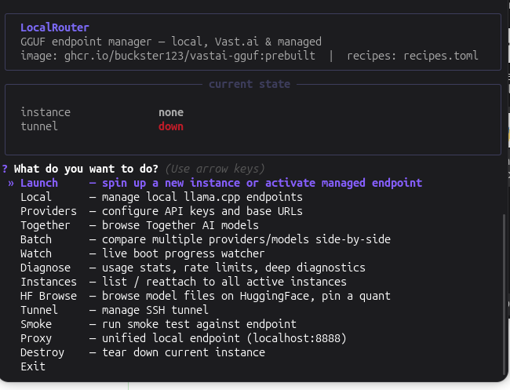
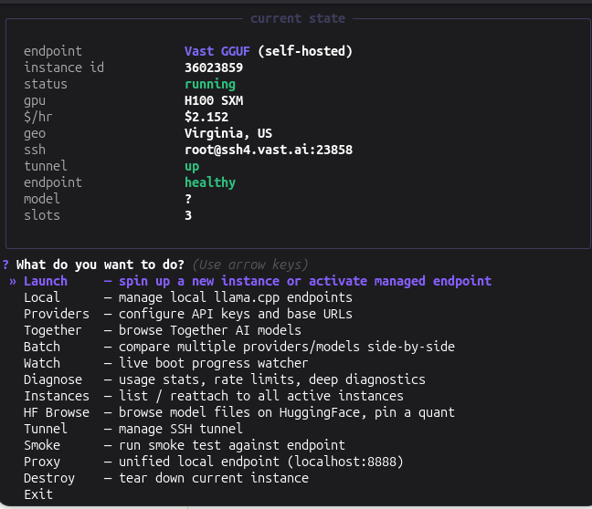

<div align="center">

# 🔀 LocalRouter

**Your private LLM inference hub — local hardware, rented GPUs, or managed APIs.**
**One TUI. One proxy. Zero vendor lock-in.**

[](https://python.org)
[](LICENSE)
[](https://github.com/buckster123/LocalRouter/releases/tag/v0.3.0)



*The main menu — launch endpoints, browse models, run diagnostics, all from your terminal.*

</div>

---

## Why LocalRouter?

You've got a local GPU, a Vast.ai account, maybe a Together AI key — but juggling three different CLIs, SSH tunnels, and config files is a pain. LocalRouter unifies all of that behind a single interactive TUI and a transparent local proxy (`localhost:8888`). Your clients never know which backend is active.

```
pip install localrouter        # or: git clone + pip install -e .
localrouter                    # launch the TUI
```

That's it. No YAML configs to write, no Docker required for local mode, no separate tunnel scripts to remember.

---

## Features at a Glance

| | Feature | What it does |
|---|---------|-------------|
| 🖥️ | **Local inference** | Run GGUF models on your own hardware — Vulkan, ROCm, CUDA, or CPU via llama.cpp |
| ☁️ | **Vast.ai rental** | One-click GPU rental: pick a tier (4090 → 8×H100) → recipe → geo → launch |
| ⚡ | **vLLM serving** | Tensor-parallel serving for 1T+ MoE models across multi-GPU clusters |
| 🤝 | **Together AI** | Connect 229+ managed models, hot-swap providers mid-session |
| 🔀 | **Unified proxy** | `localhost:8888` routes to whichever provider is active — swap backends, not code |
| 📊 | **Usage tracking** | Per-provider cost logging (JSONL), session totals, rate-limit monitoring |
| 🔍 | **Batch compare** | Send the same prompt to multiple providers, see results & metrics side-by-side |
| 🧙 | **Launch wizard** | Guided flow: GPU tier → model recipe → geo preference → offer → spin up |
| ✏️ | **Recipe editor** | TUI-based editor for recipes, GPU tiers, and docker images — no manual TOML editing |
| 🔧 | **Deep diagnostics** | SSH probes, download speed checks, stall detection & automatic recovery |

---

## Quick Start

### 1. Install

```bash
# From PyPI (when published) or from source:
git clone https://github.com/buckster123/LocalRouter.git
cd LocalRouter
pip install -e .

# Now you have the `localrouter` command globally
```

### 2. Pick your mode

<details>
<summary><b>🖥️ Local mode</b> — no API keys, no cloud, just your GPU</summary>

Point recipes at your GGUF models and go:

```bash
# Prerequisites: compiled llama.cpp + GGUF models in ~/models/
localrouter                    # TUI → Local → Launch → pick recipe
```

The TUI auto-discovers:
- `llama-server` binaries from `PATH` or `~/llama.cpp/build*/bin/`
- GGUF files in `~/models/` (configurable)
- Available backends (Vulkan, ROCm/HIP, CUDA, CPU)

</details>

<details>
<summary><b>☁️ Vast.ai GGUF mode</b> — rent a GPU, get an endpoint</summary>

```bash
pip install vastai              # one-time
vastai set api-key <your-key>   # from console.vast.ai
localrouter                     # TUI → Launch → Vast GGUF
```

The wizard walks you through: GPU tier → model → geo → offer → launch.
Use **Watch** to follow boot progress, **Tunnel** to forward locally.

</details>

<details>
<summary><b>⚡ vLLM mode</b> — tensor-parallel for massive MoE models</summary>

For models too large for llama.cpp — like DeepSeek V4 Pro (1.6T params) across 4-8 GPUs:

```bash
localrouter                     # TUI → Launch → pick a vLLM recipe
```

vLLM recipes auto-configure tensor parallelism, FlashInfer attention, FP8 KV cache,
and chunked prefill. The launch script detects GPU count and sets everything up.

Pre-configured for DeepSeek V4 Pro and Flash on H100, H200, B200, and A100 clusters.

</details>

<details>
<summary><b>🤝 Together AI</b> — managed inference, 229+ models</summary>

```bash
mkdir -p ~/.vastai-gguf
cat > ~/.vastai-gguf/config.toml << 'EOF'
[provider.together]
api_key = "sk-xxxxx"
base_url = "https://api.together.ai/v1"
EOF
```

The TUI picks it up automatically — browse models, pin your choice, hot-swap.

</details>

---

## The Proxy — One Endpoint to Rule Them All

```
Client (curl / Python / Hermes / …)
         │
         ▼
   localhost:8888          ← always the same URL
         │
    ┌────┴─────┐
    │  Proxy   │          ← routes to active provider
    └────┬─────┘
         │
   ┌─────┼──────┬──────────┐
   ▼     ▼      ▼          ▼
 Local  Vast  vLLM     Together
(llama) (GGUF)(tensor)  (managed)
```

OpenAI-compatible API: `/v1/chat/completions`, `/v1/completions`, health check at `/health`.
Switch providers from the TUI — clients don't change a thing.

---

## Recipe System

Everything is driven by `recipes.toml` — **70 pre-configured recipes** across **19 GPU tiers** and **4 providers**. Edit recipes from the TUI (Editor menu) or directly in TOML:

```toml
# Local GPU
[[recipes]]
name       = "local-qwen35-9b"
provider   = "local"
label      = "Qwen3.5-9B  Q4_K_M  (local Vulkan)"
model_path = "~/models/Qwen3.5-9B-Q4_K_M.gguf"
port       = 8100
ctx        = 32768
backend    = "vulkan"

# Rented GPU via Vast.ai (llama.cpp)
[[recipes]]
name        = "qwen36-35b-h100"
label       = "Qwen3.6-35B-A3B  Q8_0  128K ctx"
gpu         = "h100-sxm"
model_repo  = "unsloth/Qwen3.6-35B-A3B-GGUF"
model_quant = "Q8_0"
ctx         = 131072

# vLLM tensor-parallel (multi-GPU clusters)
[[recipes]]
name             = "dsv4-pro-5xh200"
provider         = "vllm"
label            = "DSv4-Pro 1.6T  FP4+FP8  384K ctx  (5×H200)"
gpu              = "h200-sxm-5x"
model_id         = "deepseek-ai/DeepSeek-V4-Pro"
ctx              = 393216
image_type       = "vllm"
kv_cache_dtype   = "fp8"
reasoning_parser = "deepseek_r1"

# Managed API
[[recipes]]
name        = "together-qwen3-32b"
provider    = "together"
label       = "Qwen3-32B (managed)"
model_id    = "Qwen/Qwen3-32B"
```

### GPU Tiers

From consumer cards to datacenter clusters:

| Tier | VRAM | Use case |
|------|------|----------|
| RTX 4090 | 24 GB | Budget GGUF (Qwen 9-27B) |
| RTX 5090 | 32 GB | Sweet spot for 27-35B GGUF |
| RTX PRO 6000 | 96 GB | Large models, huge context |
| H100 SXM | 80 GB | Datacenter single-GPU |
| 2×–4× H100 | 160–320 GB | DSv4-Flash GGUF |
| 2×–5× H200 | 282–705 GB | DSv4-Flash/Pro via vLLM |
| 4×–8× B200 | 768+ GB | DSv4-Pro at full quality |

---

## TUI Menu

| Menu item | What it does |
|-----------|-------------|
| **Launch** | Guided wizard: Local / Vast GGUF / vLLM / Together → spin up |
| **Local** | Manage local llama.cpp endpoints (launch / status / logs / stop) |
| **Providers** | Configure API keys and base URLs |
| **Together** | Browse Together AI models, pin a choice |
| **Batch** | Compare multiple providers side-by-side |
| **Watch** | Live boot watcher — polls status + logs until healthy |
| **Diagnose** | Usage stats, rate limits, SSH probes, stall detection |
| **Instances** | List active Vast instances, reattach |
| **HF Browse** | Browse HuggingFace model files, pin a quant |
| **Editor** | Recipes, GPU tiers, docker images — full CRUD with validation |
| **Tunnel** | SSH tunnel: up / status / down / logs |
| **Smoke** | Provider-aware smoke tests (health, completion, tools, throughput) |
| **Proxy** | Start/stop the local proxy on `localhost:8888` |
| **Destroy** | Tear down current Vast instance |

<div align="center">


*Running with an H100 SXM on Vast.ai — tunnel up, endpoint healthy, 3 slots.*
</div>

---

## Architecture

```
localrouter/
├── menus/
│   ├── main.py            # Main menu loop
│   ├── local_menus.py     # Local llama.cpp management
│   ├── vast_menus.py      # Vast.ai + vLLM launch wizard
│   ├── provider_menus.py  # Provider config & switching
│   ├── editor_menus.py    # Recipe/tier/image editor TUI
│   └── tool_menus.py      # Tunnel, proxy, diagnostics
├── config.py              # Settings & recipe loading
├── recipe_editor.py       # TOML read/write, recipe CRUD, validation
├── providers.py           # Provider abstraction layer
├── proxy.py               # Transparent proxy server
├── local_endpoint.py      # Local llama-server lifecycle
├── vast_ops.py            # Vast.ai API operations
├── hf_browser.py          # HuggingFace model browser
├── cost.py                # Cost tracking & rate limits
└── helpers.py             # Shared utilities
```

~5,000 lines of Python. 18 modules. `pip install -e .` and you're done.

---

## Usage Tracking

Every completion is logged to `~/.vastai-gguf/usage.log` (JSONL):

```json
{"ts":"2026-05-02T20:15:32","provider":"vast_gguf","model":"Qwen3.6-35B-A3B-Q8_0",
 "prompt_tokens":42,"completion_tokens":128,"cost":0.0012}
```

Local inference logs at $0. View stats in the **Diagnose** screen or programmatically:

```bash
python3 -c "from usage_tracker import format_summary; print(format_summary(24))"
```

---

## Security

- **Vast.ai**: `launch.sh` / `launch_vllm.sh` bind to `127.0.0.1:8000` inside the container. Access only via SSH tunnel (`tools/vast_tunnel.sh`) or the local proxy.
- **Local**: Binds to `127.0.0.1` by default — never exposed to the network.
- **Config**: API keys stored in `~/.vastai-gguf/config.toml` (not in the repo).

---

## Requirements

| Dependency | Required for |
|-----------|-------------|
| Python 3.10+ | Everything |
| `questionary`, `rich`, `tomli_w` | TUI + recipe editor (auto-installed) |
| `vastai` CLI | Vast.ai mode only |
| llama.cpp (compiled) | Local mode only |
| Together AI API key | Together mode only |
| `aiohttp` | Proxy server (`pip install localrouter[proxy]`) |

---

## License

MIT — do what you want with it.
